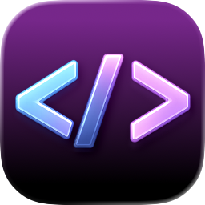
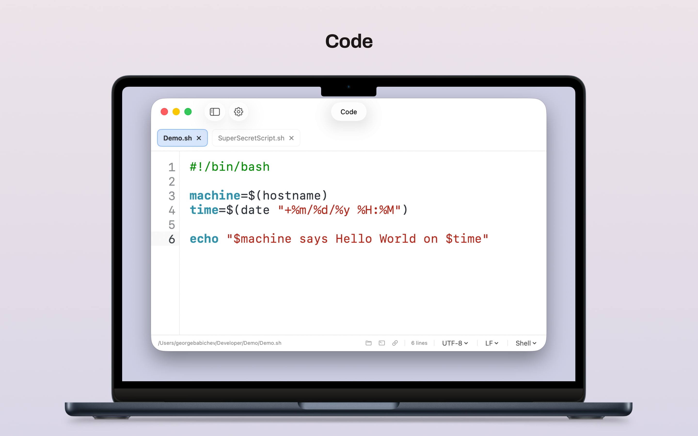
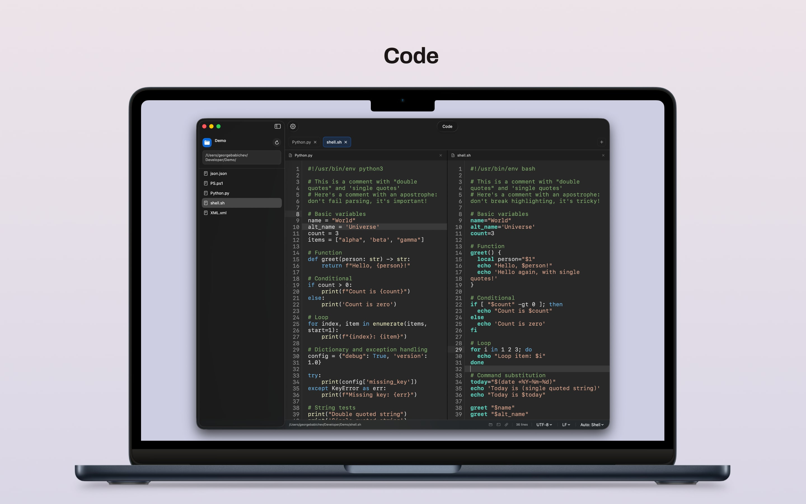

# Code

<p align="center">
  
</p>

<p align="center">
  Lightweight macOS editor for quick file edits, scripts, and side-by-side work.
</p>

<p align="center">
  <a href="https://gbabichev.github.io/Code/">Website</a>
</p>

## Overview

Code is a small macOS-only editor built for the moments when a full IDE feels excessive. It is designed for fast edits on local files, scripts, configs, and quick tasks without plugins, onboarding flows, or heavy project tooling.

<p align="center">
  
</p>


## Features

- Folder browser in the sidebar
- Multiple tabs, split view, and multi-window support
- Finder `Open With` support for quick edits from Finder
- Open files by drag and drop, single-file open, or full folder open
- Per-window `Close Folder` reset and open-in-new-window workflow
- Session recovery across relaunch, including unsaved work
- Syntax highlighting for Shell, PowerShell, Python, Markdown, XML, JSON, and property list files
- Lightweight autocomplete for in-file functions and variables
- In-editor find and replace
- Settings for theme, skin, font, indent width, word wrap, and syntax highlighting
- Large-file optimizations, including viewport-first highlighting and huge-file wrap safeguards
- Status bar tools for line count, encoding, line endings, Finder, Terminal, and file URL copying
- JSON-backed syntax skin system with import/export

## 🖥️ Install & Minimum Requirements

- macOS 26.0 or later  
- Apple Silicon & Intel
- ~10 MB free disk space  

### ⚙️ Installation
Grab it from the Releases. 

## Skin Schema

Skins are JSON files loaded from:

- Bundled app resources: `Code/Skins/*.json`
- User skins: `~/Library/Application Support/Basic Editor/Skins/*.json`

The selected skin is persisted by `id`, so bundled and imported skins use the same path.

### Schema

```json
{
  "schemaVersion": 1,
  "id": "forest",
  "name": "Forest",
  "editor": {
    "background": { "light": "#F2F5E6FF", "dark": "#171C18FF" },
    "foreground": { "light": "#2B3328FF", "dark": "#D9E3D2FF" }
  },
  "tokens": {
    "keyword":  { "light": "#007768FF", "dark": "#88F2DDFF" },
    "builtin":  { "light": "#2759B8FF", "dark": "#75B8FFFF" },
    "variable": { "light": "#A75A0BFF", "dark": "#F5C467FF" },
    "string":   { "light": "#2F7A1FFF", "dark": "#A8E882FF" },
    "comment":  { "light": "#6A7A67FF", "dark": "#78907BFF" },
    "command":  { "light": "#6A2FB0FF", "dark": "#D5A3FFFF" }
  },
  "languageOverrides": {
    "shell": {
      "keyword":  { "light": "#007768FF", "dark": "#88F2DDFF" },
      "builtin":  { "light": "#2759B8FF", "dark": "#75B8FFFF" },
      "variable": { "light": "#A75A0BFF", "dark": "#F5C467FF" },
      "string":   { "light": "#2F7A1FFF", "dark": "#A8E882FF" },
      "comment":  { "light": "#6A7A67FF", "dark": "#78907BFF" },
      "command":  { "light": "#6A2FB0FF", "dark": "#D5A3FFFF" }
    }
  }
}
```

### Notes

- Colors are hex strings in `#RRGGBB` or `#RRGGBBAA` format.
- `tokens` is the generic fallback palette.
- `languageOverrides` is keyed by language id like `shell`.
- The schema is intentionally semantic rather than regex-specific.

That matters for future languages. The JSON should describe roles like `keyword`, `string`, `comment`, `builtin`, `variable`, and `command`, with room to add roles such as `type`, `number`, `operator`, `function`, `property`, `decorator`, or `attribute` later without redesigning the format.

## Import / Export

- Import from the settings popover copies a validated skin JSON into the app support skins folder.
- Export writes the currently selected skin back out as JSON.

## 📝 Changelog

### 1.0.0
- Initial Release.
