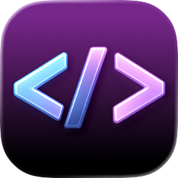
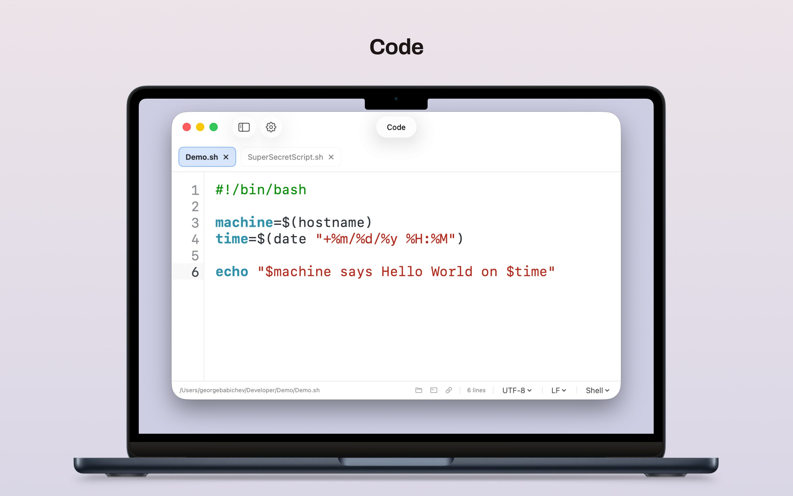
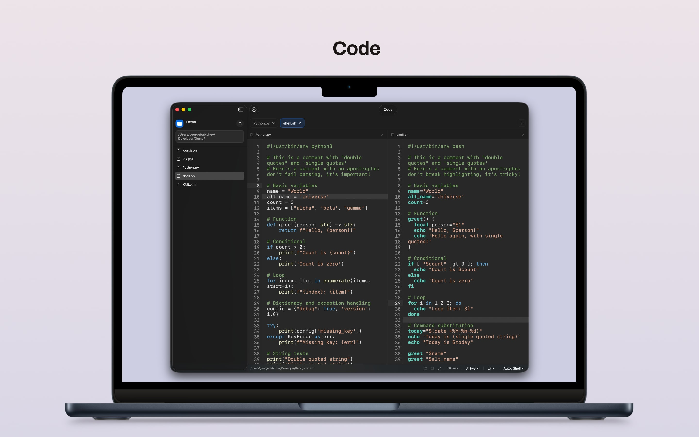

# Code

  

  Lightweight macOS editor for quick file edits, scripts, and side-by-side work.

  <a href="https://gbabichev.github.io/Code/">Website</a>

## Overview

Code is a small macOS-only editor built for the moments when a full IDE feels excessive. It is designed for fast edits on local files, scripts, configs, and quick tasks without plugins, onboarding flows, or heavy project tooling.

  

## Features

- Folder browser in the sidebar
- Multiple tabs, split view, and multi-window support
- Finder `Open With` support for quick edits from Finder
- Optional `code` command for opening files and folders from Terminal
- Open files by drag and drop, multi-file open, full folder open, or Dock menu shortcuts
- Clear prompts when saving to protected folders
- Per-window `Close Folder` reset and open-in-new-window workflow
- Session recovery across relaunch, including unsaved work
- Markdown preview with rendered Markdown, basic HTML, and images
- Syntax highlighting for Shell, PowerShell, Python, Markdown, XML, JSON, and property list files
- File-aware smart indentation, smart backspace, bracket matching, and a fix indentation tool
- Whitespace tools including invisibles, trim trailing whitespace on save, final newline, and tab/space conversion
- Lightweight autocomplete for in-file functions and variables
- In-editor find and replace
- Settings for theme, skin, font, indent width, word wrap, and syntax highlighting
- Responsive editing for large files
- Status bar tools for file state, indentation, line count, encoding, line endings, Finder, Terminal, and file URL copying
- Import and export custom editor skins

## 🖥️ Install & Minimum Requirements

- macOS 14.0 or later  
- Apple Silicon & Intel
- ~10 MB free disk space  

### ⚙️ Installation
Grab it from the Releases. 

### Terminal command and administrator saves

Code can install an optional `code` command from the app menu, so you can open files and folders from Terminal with `code file.txt` or `code .`.

If macOS needs administrator approval for the command or for saving into a protected folder, Code explains what is happening first and asks only for that action.

## Customization

Choose a light or dark appearance, switch editor skins, adjust font and wrapping, and import or export skins from the settings popover.

## 📝 Changelog

### 1.1.0
- Added Markdown preview support with rendered Markdown, basic HTML, and images.
- Open File now supports selecting multiple files and opening each one in a tab.
- Added file-aware smart indentation, smart backspace, bracket matching, and a Fix Indentation tool.
- Added whitespace tools for invisibles, trailing whitespace trimming on save, final newlines, and tab/space conversion.
- Improved Shell syntax highlighting.
- Improved status bar and tab bar reporting for file state, read-only files, external changes, large or binary files, and indentation issues.

### 1.0.2
- Another tweak to syntax highlighting to prevent scroll jumps. 

### 1.0.1
- Tweaked syntax highlighting to prevent scroll jumps under certain cases. 
- Updated Check for Update UX.

### 1.0.0
- Initial Release.
